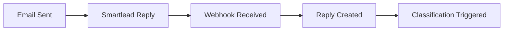
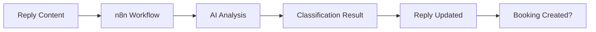
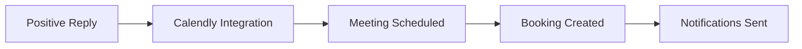

# Reply & Booking Module Documentation

## Overview

The Reply & Booking Module is a comprehensive system for managing email replies, AI-powered classification, and meeting scheduling in the cold outreach platform. It handles the complete lifecycle from receiving replies to scheduling meetings with qualified leads.

## 🏗️ Architecture

### Module Structure
```
/replies/
├── constants/
│   └── reply.constants.ts          # Enums and validation rules
├── entities/
│   ├── reply.entity.ts             # Reply business logic
│   └── booking.entity.ts           # Booking business logic
├── dto/
│   ├── reply.dto.ts                # Reply request/response schemas
│   └── booking.dto.ts              # Booking request/response schemas
├── mappers/
│   ├── reply.mapper.ts             # Data transformation
│   └── booking.mapper.ts           # Data transformation
├── repositories/
│   ├── reply.repository.ts         # Database operations
│   └── booking.repository.ts       # Database operations
├── services/
│   ├── reply.service.ts            # Business logic
│   └── booking.service.ts          # Business logic
├── controllers/
│   ├── reply.controller.ts         # HTTP endpoints
│   ├── booking.controller.ts       # HTTP endpoints
│   └── reply-webhook.controller.ts # Webhook handlers
└── replies.module.ts               # Module wiring
```

### Key Features

✅ **Reply Management**
- Store and classify email replies
- AI-powered sentiment analysis
- Multi-source reply ingestion (Smartlead, manual, webhooks)
- Reply lifecycle tracking

✅ **Booking Management**
- Automated meeting scheduling
- Calendly integration
- Booking status management
- Rescheduling and cancellation

✅ **Workflow Integration**
- n8n workflow triggers
- Automated reply classification
- Meeting scheduling automation
- Event logging and audit trails

✅ **Multi-tenant Security**
- Company-scoped data isolation
- JWT authentication
- Role-based access control
- Secure webhook handling

## 🔄 Reply Lifecycle

### 1. Reply Reception


### 2. AI Classification


### 3. Meeting Scheduling


## 📡 API Endpoints

### Reply Endpoints

#### Create Reply
```http
POST /replies
Authorization: Bearer <token>
Content-Type: application/json

{
  "content": "I'm interested in learning more about your solution",
  "leadId": "lead_123",
  "emailLogId": "email_456",
  "source": "MANUAL",
  "metadata": {
    "subject": "Re: Cold Outreach",
    "from": "prospect@company.com"
  }
}
```

#### Get Replies (Paginated)
```http
GET /replies?cursor=reply_123&limit=20&classification=INTERESTED
Authorization: Bearer <token>
```

#### Update Reply
```http
PUT /replies/{id}
Authorization: Bearer <token>
Content-Type: application/json

{
  "classification": "INTERESTED",
  "handledBy": "user_123"
}
```

#### Get Reply Statistics
```http
GET /replies/stats/overview
Authorization: Bearer <token>
```

### Booking Endpoints

#### Create Booking
```http
POST /bookings
Authorization: Bearer <token>
Content-Type: application/json

{
  "calendlyLink": "https://calendly.com/company/meeting",
  "scheduledTime": "2024-01-15T10:00:00Z",
  "leadId": "lead_123",
  "replyId": "reply_456",
  "metadata": {
    "duration": 30,
    "meetingType": "discovery"
  }
}
```

#### Get Bookings (Paginated)
```http
GET /bookings?cursor=booking_123&limit=20&status=BOOKED
Authorization: Bearer <token>
```

#### Reschedule Booking
```http
POST /bookings/{id}/reschedule
Authorization: Bearer <token>
Content-Type: application/json

{
  "calendlyLink": "https://calendly.com/company/meeting-new",
  "scheduledTime": "2024-01-16T14:00:00Z",
  "reason": "Conflict with existing meeting"
}
```

#### Cancel Booking
```http
POST /bookings/{id}/cancel
Authorization: Bearer <token>
Content-Type: application/json

{
  "reason": "Prospect unavailable"
}
```

### Webhook Endpoints

#### Smartlead Webhook
```http
POST /webhooks/replies/smartlead
X-Smartlead-Signature: <signature>
Content-Type: application/json

{
  "leadId": "lead_123",
  "emailId": "email_456",
  "replyContent": "I'm interested in learning more",
  "replySubject": "Re: Cold Outreach",
  "replyFrom": "prospect@company.com",
  "timestamp": "2024-01-10T15:30:00Z"
}
```

#### Generic Webhook
```http
POST /webhooks/replies/generic
X-Webhook-Token: <token>
Content-Type: application/json

{
  "leadId": "lead_123",
  "emailLogId": "email_456",
  "content": "Reply content here",
  "metadata": {
    "source": "custom_integration"
  }
}
```

## 🔧 Configuration

### Environment Variables
```bash
# Webhook Security
WEBHOOK_TOKEN=your_webhook_token_here
SMARTLEAD_WEBHOOK_SECRET=your_smartlead_secret_here

# n8n Integration
N8N_BASE_URL=https://your-n8n-instance.com
N8N_API_KEY=your_n8n_api_key

# Calendly Integration
CALENDLY_API_KEY=your_calendly_api_key
CALENDLY_WEBHOOK_SECRET=your_calendly_webhook_secret
```

### Reply Classification Types
```typescript
enum ReplyClassification {
  INTERESTED = 'INTERESTED',           // Positive response
  NOT_INTERESTED = 'NOT_INTERESTED',   // Negative response
  AUTO_REPLY = 'AUTO_REPLY',          // Automated response
  UNSUBSCRIBE = 'UNSUBSCRIBE',        // Unsubscribe request
  QUESTION = 'QUESTION',              // Question requiring follow-up
  NEUTRAL = 'NEUTRAL',                // Neutral response
}
```

### Booking Status Types
```typescript
enum BookingStatus {
  BOOKED = 'BOOKED',                  // Confirmed booking
  RESCHEDULED = 'RESCHEDULED',        // Rescheduled booking
  CANCELLED = 'CANCELLED',            // Cancelled booking
  COMPLETED = 'COMPLETED',            // Completed meeting
  PENDING = 'PENDING',                // Pending confirmation
}
```

## 🔄 Workflow Integration

### Reply Classification Workflow

When a reply is received, the system triggers an n8n workflow for AI classification:

```typescript
// Payload sent to n8n
{
  "leadId": "lead_123",
  "emailLogId": "email_456",
  "replyContent": "I'm interested in learning more",
  "credentials": {
    "openai_api_key": "sk-...",
    "smartlead_api_key": "sl-..."
  },
  "config": {
    "classification_model": "gpt-4",
    "confidence_threshold": 0.8
  }
}
```

### Workflow Completion Handler

When the n8n workflow completes, it calls back to update the reply:

```typescript
// Payload received from n8n
{
  "replyId": "reply_123",
  "companyId": "company_456",
  "replySentiment": "INTERESTED",
  "meetingLink": "https://calendly.com/company/meeting",
  "metadata": {
    "confidence": 0.95,
    "processingTime": 1500,
    "aiModel": "gpt-4"
  }
}
```

## 📊 Data Models

### Reply Entity
```typescript
class ReplyEntity {
  id: string;
  content: string;
  classification: ReplyClassification;
  leadId: string;
  emailLogId: string;
  companyId: string;
  handledBy: string | null;
  source: ReplySource;
  metadata: Record<string, any> | null;
  createdAt: Date;
  updatedAt: Date;

  // Computed properties
  isInterested: boolean;
  isNegative: boolean;
  isNeutral: boolean;
  sentimentScore: number;
  requiresAttention: boolean;
  priority: 'high' | 'medium' | 'low';
}
```

### Booking Entity
```typescript
class BookingEntity {
  id: string;
  calendlyLink: string;
  scheduledTime: Date;
  status: BookingStatus;
  leadId: string;
  companyId: string;
  replyId: string | null;
  metadata: Record<string, any> | null;
  createdAt: Date;
  updatedAt: Date;

  // Computed properties
  isActive: boolean;
  isConfirmed: boolean;
  isUpcoming: boolean;
  isToday: boolean;
  timeUntilBooking: number;
  priority: 'high' | 'medium' | 'low';
}
```

## 🔐 Security Considerations

### Authentication
- All endpoints require JWT authentication
- Company-scoped data isolation
- Role-based access control

### Webhook Security
- Signature validation for Smartlead webhooks
- Token-based authentication for generic webhooks
- Rate limiting and request validation

### Data Protection
- Input validation and sanitization
- SQL injection prevention via Prisma
- XSS protection through DTOs

## 📈 Monitoring & Analytics

### Reply Metrics
- Total replies per company
- Classification distribution
- Response time analysis
- Positive reply rate

### Booking Metrics
- Booking success rate
- Meeting completion rate
- Average booking time
- Rescheduling frequency

### Dashboard Data
```typescript
// Reply Dashboard
{
  total: 150,
  byClassification: {
    INTERESTED: 45,
    NOT_INTERESTED: 30,
    AUTO_REPLY: 25,
    QUESTION: 20,
    NEUTRAL: 30
  },
  recentCount: 12,
  positiveRate: 30.0,
  averageResponseTime: 2.5
}

// Booking Dashboard
{
  total: 45,
  byStatus: {
    BOOKED: 30,
    COMPLETED: 25,
    CANCELLED: 5,
    PENDING: 5
  },
  upcomingCount: 8,
  todayCount: 2,
  completionRate: 83.3
}
```

## 🚀 Integration Examples

### Frontend Integration

#### React Component Example
```typescript
import { useReplies } from '../hooks/useReplies';

const ReplyList = () => {
  const { replies, loading, error } = useReplies({
    classification: 'INTERESTED',
    limit: 20
  });

  return (
    <div>
      {replies.map(reply => (
        <ReplyCard
          key={reply.id}
          reply={reply}
          onClassify={handleClassify}
          onHandle={handleMarkAsHandled}
        />
      ))}
    </div>
  );
};
```

#### Booking Management
```typescript
import { useBookings } from '../hooks/useBookings';

const BookingDashboard = () => {
  const { upcoming, today, stats } = useBookings();

  return (
    <div>
      <BookingCalendar upcoming={upcoming} />
      <TodayMeetings meetings={today} />
      <BookingStats stats={stats} />
    </div>
  );
};
```

### Webhook Integration

#### Smartlead Setup
1. Configure webhook URL: `https://your-api.com/webhooks/replies/smartlead`
2. Set webhook secret in Smartlead dashboard
3. Configure reply events to trigger webhook

#### Custom Integration
```typescript
// Send reply to your API
const sendReply = async (replyData) => {
  const response = await fetch('/webhooks/replies/generic', {
    method: 'POST',
    headers: {
      'Content-Type': 'application/json',
      'X-Webhook-Token': 'your_token'
    },
    body: JSON.stringify({
      leadId: replyData.leadId,
      emailLogId: replyData.emailId,
      content: replyData.content,
      metadata: {
        source: 'custom_system'
      }
    })
  });
  
  return response.json();
};
```

## 🧪 Testing

### Unit Tests
```typescript
describe('ReplyService', () => {
  it('should create reply and trigger classification', async () => {
    const reply = await replyService.create({
      content: 'I am interested',
      leadId: 'lead_123',
      emailLogId: 'email_456'
    }, 'company_123');

    expect(reply.classification).toBe('NEUTRAL');
    expect(reply.source).toBe('MANUAL');
  });
});
```

### Integration Tests
```typescript
describe('Reply Webhook', () => {
  it('should process Smartlead webhook', async () => {
    const response = await request(app)
      .post('/webhooks/replies/smartlead')
      .set('X-Smartlead-Signature', 'valid_signature')
      .send({
        leadId: 'lead_123',
        emailId: 'email_456',
        replyContent: 'I am interested'
      });

    expect(response.status).toBe(200);
    expect(response.body.success).toBe(true);
  });
});
```

## 🚨 Error Handling

### Common Error Responses
```typescript
// 400 Bad Request
{
  "statusCode": 400,
  "message": "Missing required fields: leadId, emailLogId, or content",
  "error": "Bad Request"
}

// 401 Unauthorized
{
  "statusCode": 401,
  "message": "Invalid webhook signature",
  "error": "Unauthorized"
}

// 404 Not Found
{
  "statusCode": 404,
  "message": "Reply not found",
  "error": "Not Found"
}

// 409 Conflict
{
  "statusCode": 409,
  "message": "Reply has already been handled",
  "error": "Conflict"
}
```

## 📝 Best Practices

### Reply Management
1. **Always validate reply content** before processing
2. **Use appropriate classifications** for accurate analytics
3. **Handle edge cases** like empty content or malformed data
4. **Log all operations** for audit trails

### Booking Management
1. **Validate scheduled times** are in the future
2. **Handle timezone conversions** properly
3. **Provide clear cancellation reasons**
4. **Send notifications** for booking changes

### Webhook Handling
1. **Validate signatures** for security
2. **Implement retry logic** for failed webhooks
3. **Rate limit** webhook endpoints
4. **Log webhook events** for debugging

### Performance
1. **Use pagination** for large datasets
2. **Implement caching** for frequently accessed data
3. **Optimize database queries** with proper indexing
4. **Monitor response times** and optimize slow endpoints

## 🔄 Migration & Deployment

### Database Migration
```bash
# Generate migration
npx prisma migrate dev --name add_replies_bookings

# Apply migration
npx prisma migrate deploy
```

### Environment Setup
```bash
# Copy environment variables
cp env.example .env

# Update with your values
WEBHOOK_TOKEN=your_secure_token
SMARTLEAD_WEBHOOK_SECRET=your_smartlead_secret
N8N_BASE_URL=https://your-n8n-instance.com
```

### Health Checks
```bash
# Check webhook health
curl -X POST https://your-api.com/webhooks/replies/health

# Expected response
{
  "status": "healthy",
  "timestamp": "2024-01-10T15:30:00Z"
}
```

## 📞 Support

For questions or issues with the Reply & Booking Module:

1. Check the API documentation at `/api/docs`
2. Review the logs for error details
3. Test webhook endpoints with the health check
4. Verify environment variables are correctly set

---

**Version**: 1.0.0  
**Last Updated**: January 2024  
**Maintainer**: Development Team 